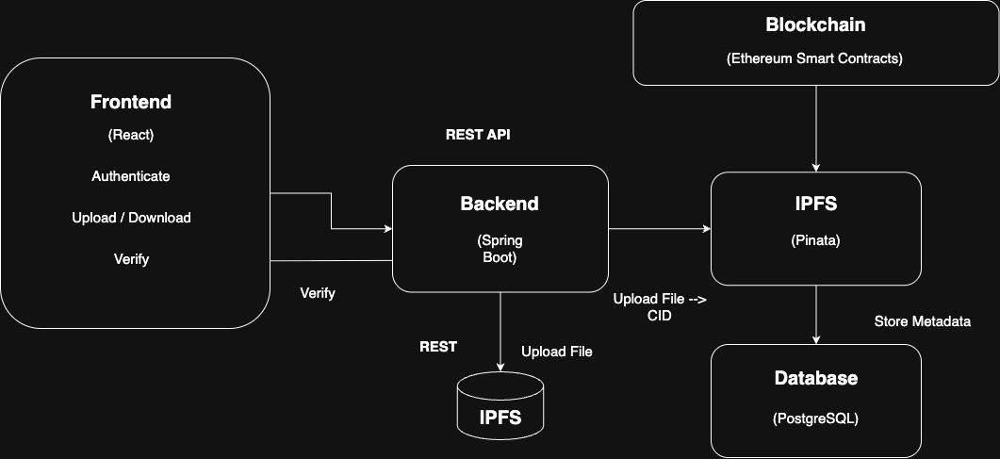

# 📜 BlockCert – Blockchain-Based Academic Credential Verification System

BlockCert is a decentralized platform that enables secure, tamper-proof issuance and verification of academic certificates using blockchain and IPFS. It is designed for educational institutions to replace traditional PDF or paper-based certificate systems with a globally verifiable and fraud-resistant alternative.
 

## 🔍 Problem Overview
Traditional certificate systems face major challenges:

❌ Forgery-prone: Physical or digital certificates can be easily manipulated.

❌ Centralized vulnerability: Data loss or corruption due to single points of failure.

❌ Inefficient verification: Manual validation by institutions causes delays.

❌ Limited accessibility: Difficult cross-border access and portability for students.

## ✅ Solution – What BlockCert Offers
**BlockCert leverages:**

- Ethereum Blockchain – to store immutable, cryptographically hashed CIDs of certificates.

- IPFS (via Pinata) – to store the actual certificate files in a decentralized manner.

- Spring Boot + PostgreSQL – to manage metadata, user roles, and authentication.

- React + Web3.js – to provide a responsive and secure interface for admins, students, and verifiers.

## 🧠 How It Works
📤 Certificate Issuance Workflow
1. Admin uploads a certificate (PDF) via dashboard.
2. Backend sends the file to IPFS ➝ receives a unique CID.
3. CID + metadata (student ID, timestamp) are hashed and stored on Ethereum via a smart contract.
4. Metadata is also saved in PostgreSQL for quick retrieval.

## ✅ Certificate Verification Workflow
1. Verifier enters the CID in the verifier dashboard.
2. System fetches the file from IPFS and compares its hash with the blockchain-stored hash.
3. If matched → ✅ Authentic. If mismatched → ❌ Tampered.

## 👨‍🎓 Student Access Workflow
1. Student logs in and views all their issued certificates.
2. Each certificate includes: 
  - Filename and issue date 
  - IPFS CID
  - Download button from IPFS
  - QR Code for portable, scannable access.

## 🏗️ System Architecture

**Other Components:**
- PostgreSQL → User & certificate metadata.
- Pinata → IPFS file pinning service.

## 🛡️ Key Features
- 🔐 Tamper-Proof: Any change in a certificate changes its CID, invalidating frauds instantly.
- 🌍 Globally Accessible: No login needed to verify – just scan a QR.
- 🔎 Auditable: All issuance events logged on-chain.
- 🧾 Role-Based Dashboards:
  - Admin: Upload & assign certificates
  - Student: View & download certificates
  - Verifier: Validate using CID

## 🧪 Performance & Security
- ⚡ ~3 sec issuance time, ~1.5 sec verification
- 🛡️ SQL Injection and CSRF protected
- 👥 100+ concurrent user handling
- 🔒 RBAC via Spring Security
- 🌐 Fully responsive & browser compatible
